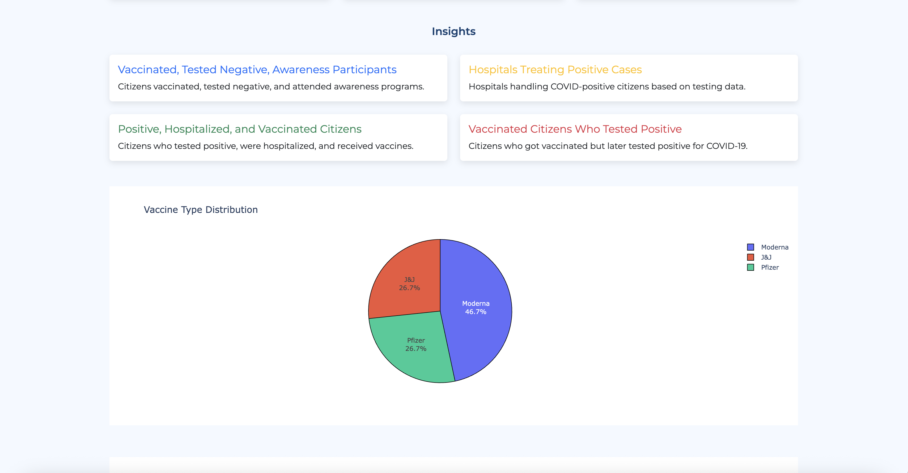
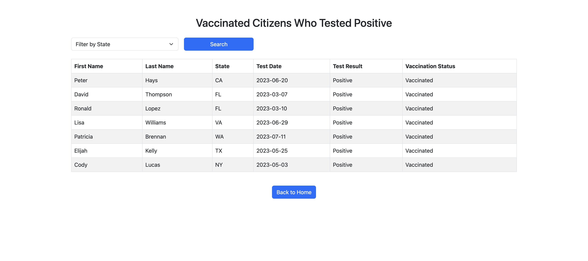
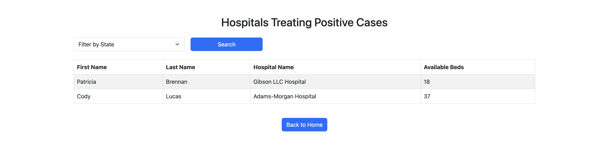

# COVID-19 Mitigation Analysis Web Portal

A full-stack web application built using **Flask** and **MongoDB** to manage and analyze COVID-19-related information, including citizens, vaccinations, testing centers, hospitals, COVID cases, and awareness programs.  
The portal integrates CRUD functionality, database-driven analytics, and interactive dashboards to support COVID-19 tracking and decision-making.

---

## Project Overview

This system centralizes multiple COVID-19 data sources into one platform where users can:

- Maintain records across six modules  
- Visualize vaccination and demographic trends  
- Explore analytical insights that combine data from multiple collections  
- Review program participation, hospitalization links, and vaccination effectiveness  

The application is designed with a modular architecture, separating routes, templates, visualizations, and database operations for maintainability and clarity.

---

## Project Preview


---

## Features

### ✔ CRUD Functionality  
Each module includes interfaces for adding, editing, deleting, and viewing records:

- Citizens  
- Vaccinations  
- COVID Cases  
- Hospitals  
- Testing Centers  
- Awareness Programs  

All operations interact directly with MongoDB, ensuring real-time updates across the system.

### ✔ Interactive Visualizations  
Visual charts are rendered using Plotly and include:

- Vaccine type distribution (pie chart)  
- Vaccine dose comparison (grouped bar chart)  



*(Some charts and screens are not included here as screenshots but are available within the live application.)*

---

## Insight Queries

The portal includes several multi-collection insights such as:

### Vaccinated Citizens Who Tested Positive


### Hospitals Treating Positive Cases


These insights analyze relationships between vaccination records, test results, hospitalization data, and demographic factors.

---

## Technology Used

- **Flask (Python)** – Routing, backend logic  
- **MongoDB Atlas** – NoSQL database  
- **PyMongo** – Database communication  
- **Plotly** – Interactive visualizations  
- **HTML, CSS, Bootstrap** – Frontend UI  
- **Jinja2** – Template rendering  

---

## Folder Structure

```
/app.py
/static
    dashboard.png
/templates
    home.html
    citizens.html
    vaccinations.html
    covid_cases.html
    hospitals.html
    testing_centers.html
    awareness_programs.html
    insight_table.html
    edit_citizen.html
    edit_vaccination.html
    edit_covid_case.html
    edit_hospital.html
    edit_testing_center.html
    edit_awareness_program.html
/dashboard_images
    home_dashboard.png
    citizens_page.png
    vaccine_type_chart.png
    vaccinated_tested_positive.png
    hospitals_treating_cases.png
```

---

## Running the Application

### 1. Install necessary packages
```
pip install flask pymongo plotly dnspython
```

### 2. Add your MongoDB connection string  
Inside `app.py`:
```
client = MongoClient(
    "your_connection_string_here",
    tls=True,
    tlsAllowInvalidCertificates=True
)
db = client["covid_mitigation_db"]
```

### 3. Start the server
```
python3 app.py
```

Application will run at:
```
http://localhost:5001
```

---

## Contributions

My work on this project included:

- Implementing backend routes and CRUD operations for all modules  
- Designing database structure and integrating MongoDB Atlas  
- Creating frontend templates for forms, tables, and navigation  
- Developing Plotly-based dashboards and integrating them into Flask  
- Writing multi-collection insight logic and data filtering  
- Testing, debugging, and ensuring smooth end-to-end functionality  

This repository reflects my implementation work and the final structure of the project.

---

## Disclaimer
Only selected screenshots are included in this README. 
Additional visualizations and insights exist in the full application but are not displayed here for brevity.

---

## Contact

Email: **sriyareddy696@gmail.com**  
Feel free to reach out with any questions or feedback.

